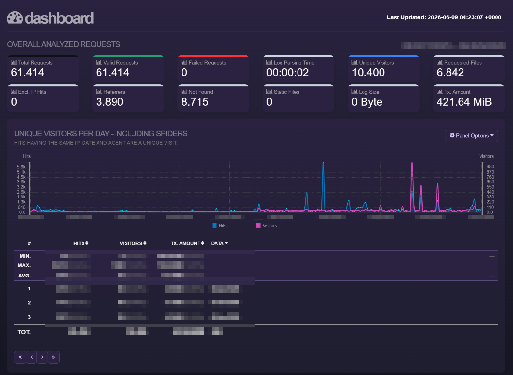

# GoAccess Static Log Reports

Deutsch | [English](README.en.md)

Dieses Projekt erzeugt statische GoAccess-Reports aus Webserver-Access-Logs, die per SFTP von einem Hosting-Provider abgeholt werden.

Es wurde für statische Websites entwickelt, bei denen keine Live-Analytics benötigt werden. Ein typischer Use Case ist eine Astro-Website ohne Login, ohne serverseitige Nutzerkonten und ohne dynamische Anwendungsschicht. Wenn der Provider Access-Logs nur einmal täglich bereitstellt, reicht ein täglicher Cronjob vollständig aus.

## Was passiert?

1. Das Script listet pro Domain die verfügbaren Remote-Logs per SFTP.
2. Fehlende lokale Dateien werden gesammelt und providerfreundlich in einer SFTP-Sitzung pro Domain geladen.
3. Alte lokale Logs werden optional anhand des Dateinamens oder mtime entfernt.
4. GoAccess läuft kurz in Docker und erzeugt pro Domain eine statische `index.html`.
5. Eine statische Landing Page verlinkt auf alle Domain-Reports.
6. nginx liefert nur die fertigen statischen HTML-Dateien aus.

## Providerfreundliche Defaults

```bash
SFTP_MAX_FILES_PER_RUN=25
SFTP_FILE_DELAY_SECONDS=2
SFTP_DOMAIN_DELAY_SECONDS=5
```

Diese Werte vermeiden aggressive Backfills. Im Normalbetrieb wird meist nur eine neue Tagesdatei pro Domain geladen.

## Installation

Siehe [`docs/de/installation.md`](docs/de/installation.md).

## Konfiguration

Siehe [`docs/de/configuration.md`](docs/de/configuration.md).

## Cron

Siehe [`docs/de/cron.md`](docs/de/cron.md).

## Beispielausgabe

Das Projekt erzeugt zwei statische Ansichten:

1. eine eigene Landing Page mit Links auf alle konfigurierten Domain-Reports
2. pro Domain einen regulären GoAccess-HTML-Report

Die Optik des eigentlichen Reports wird von GoAccess erzeugt. Die Landing Page wird zusätzlich von diesem Script erstellt, damit mehrere Domains bequem über eine interne Startseite erreichbar sind.



## GeoIP

GeoIP ist in diesem Projekt absichtlich nicht standardmäßig aktiviert.

GoAccess kann Länder- oder Stadtstatistiken nur erzeugen, wenn zusätzlich eine GeoIP-Datenbank wie MaxMind GeoLite2 oder DB-IP bereitgestellt und in den Container gemountet wird. Diese Datenbanken haben eigene Lizenz-, Download- und Update-Anforderungen.

Da dieses Projekt bewusst schlank bleiben soll, wird keine GeoIP-Datenbank mitgeliefert und keine automatische GeoIP-Aktualisierung eingerichtet. Außerdem anonymisieren manche Hosting-Provider IP-Adressen in Weblogs, wodurch GeoIP-Auswertungen ungenau oder unvollständig sein können.

Wer GeoIP nutzen möchte, kann es später manuell ergänzen, indem eine passende `.mmdb`-Datei gemountet und `geoip-database` in der GoAccess-Konfiguration gesetzt wird.

## Lizenz

Dieses Projekt steht unter der MIT License.

Du darfst es frei verwenden, kopieren, verändern und weitergeben. Die Nutzung erfolgt ohne Gewährleistung und ohne Haftung durch die Autorinnen und Autoren.

Den vollständigen Lizenztext findest du in der Datei [`LICENSE`](LICENSE).
