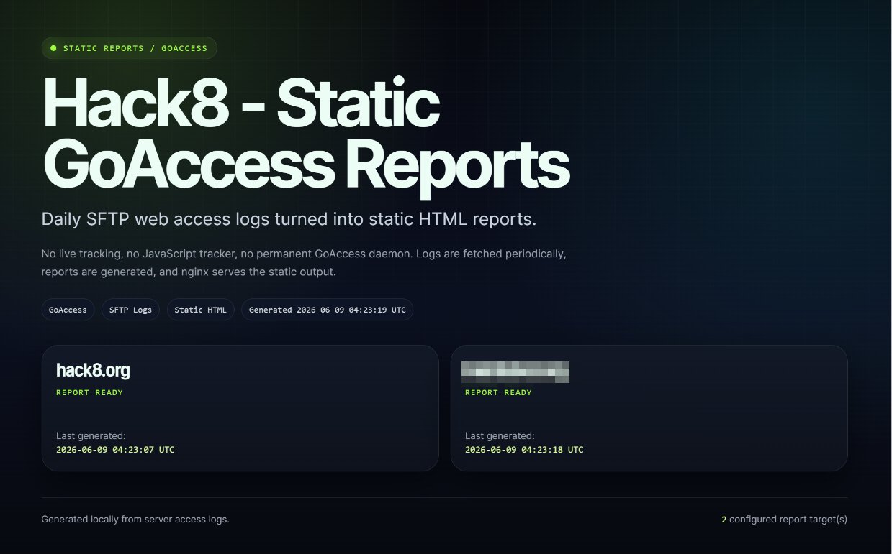
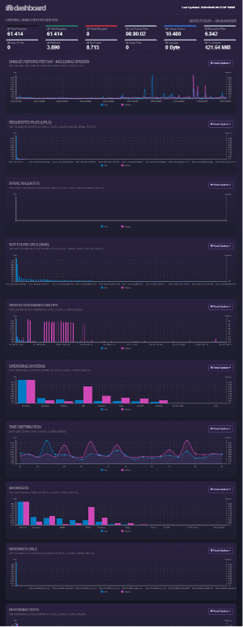
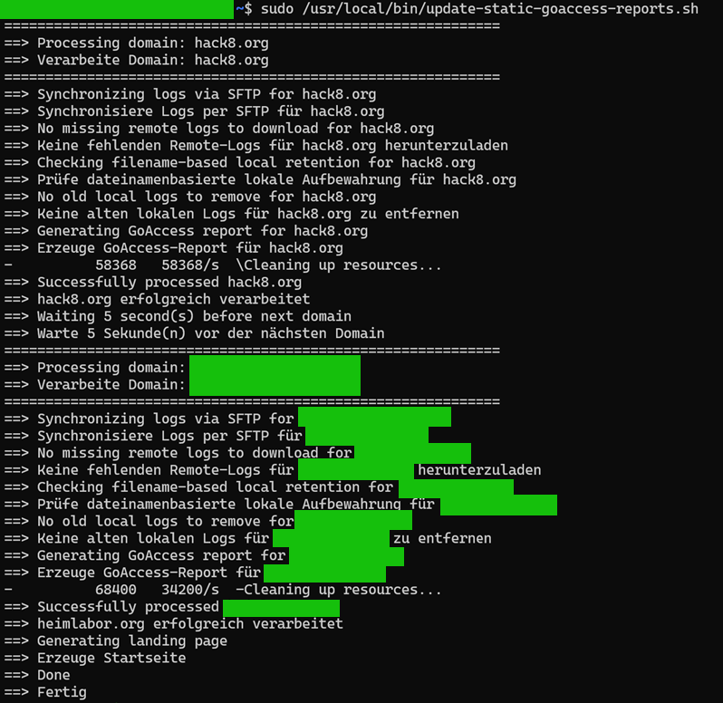

# Screenshots and example output

The project generates a custom static landing page and one regular GoAccess report per domain. The screenshots show the overall flow and the most important outputs without exposing sensitive infrastructure details.

## Landing page

The landing page is written to:

```text
/opt/goaccess/static-log-reports/html/index.html
```

It automatically links to all domains configured in `DOMAINS=(...)` and acts as the entry point for multiple static reports.



**What it shows:**

- a compact overview of multiple configured domains
- status cards with the timestamp of the latest report generation
- direct links to the individual domain reports
- a fully static entry page without a running analytics web application

## GoAccess report: overview

Each domain report is generated by GoAccess itself and written to:

```text
/opt/goaccess/static-log-reports/html/<domain>/index.html
```


**What it shows:**

- aggregated metrics for requests, visitors, and bandwidth
- request distribution over time
- requested files and paths
- status codes and typical technical metrics
- browser, operating system, and referrer sections if the logs contain that information

The screenshot uses example/demo output. For public repositories, do not use screenshots that expose real IP addresses, credentials, internal hostnames, private query parameters, or sensitive referrers.

## GoAccess report: full-page view

GoAccess combines many analysis sections into a single HTML file. The full-page view shows the report as a longer scrolling page.



**What it shows:**

- several report sections stacked vertically
- technical detail sections such as requests, files, status codes, operating systems, and browsers
- a static HTML output that can be opened without a database or live service

This view helps explain that the report is more than a single metrics card: it combines many log sections into one generated file.

## Script test run

The update script can be run in a way that makes the workflow visible in the terminal.



**What it shows:**

- loading and checking the configuration
- SFTP/log processing steps
- generation of the static GoAccess output
- checks that the expected result files exist
- clear console output for troubleshooting and operation

The test run is mainly a verification aid: it shows which steps ran and where a problem would appear.

## Publishing screenshots safely

Before publishing your own screenshots, remove sensitive details or replace them with example data. This includes in particular:

- IP addresses
- credentials or tokens
- internal hostnames
- private paths and query parameters
- sensitive referrers
- customer names or other personal information
